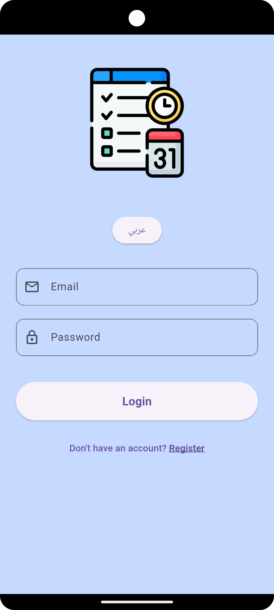
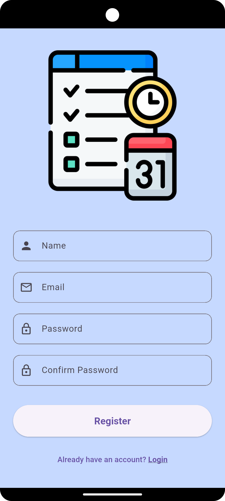
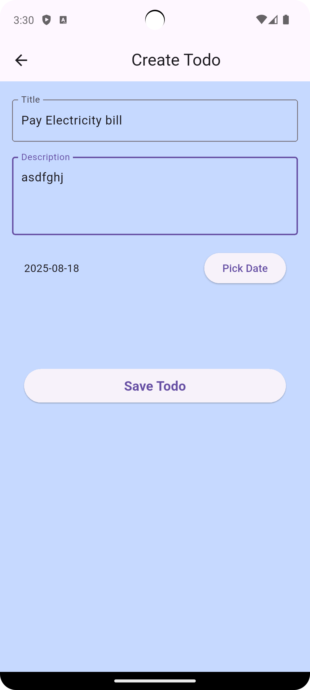
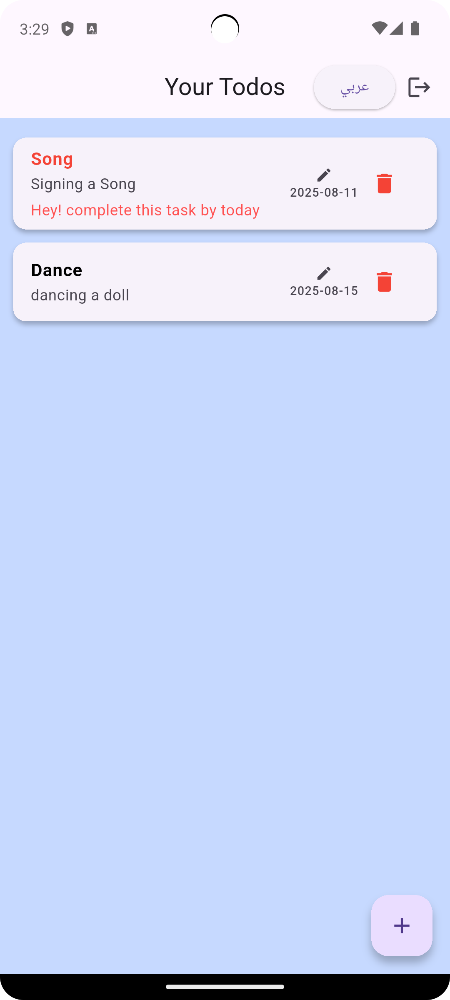

# Code Base Assignment

A Flutter application demonstrating authentication, CRUD operations, and localization.

## ✨ Features
- **Login**
- **Register**
- **Create Todo**
- **Show Todo List**
- **Update Todo**
- **Delete Todo**
- **Log out**

## 🛠️ Tech Stack
- **Flutter** for UI
- **Bloc State Management
- **Internet Connection 
- **Cloud Firestore** as Remote Database
- **Hive** as Local Database
- **Localization** for English 🇬🇧 and Arabic 🇦🇪

## 📸 Screenshots

### Login


### Register


### Create Todo


### Todo List


## 🚀 Getting Started

### Prerequisites
- Flutter SDK installed
- Firebase project configured

### Setup
1. Clone the repository
   ```bash
   git clone <https://github.com/aish171294/codebase_assignment.git>
